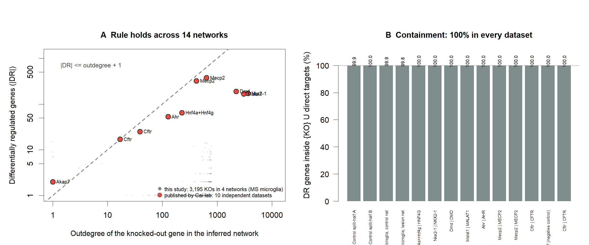

# 跨数据集复现：10 个独立网络上的验证

日期：2026-09-14

---

## 1. 为什么这一步做得比预想便宜

原本计划下载 3–5 个公开数据集、各自重新建网（每个约 25 分钟）。但检索作者仓库时发现：**他们把自己发表分析中使用的网络与敲除结果都保存下来了**（`inst/manuscript/*/Results/*.RData`）。

这些是**独立于本项目的数据**——不同的疾病、组织、物种、基因，而且已经过同行评审发表。直接复用它们做验证，比我自建 3–5 个网络更有说服力，成本也低得多（下载 108 MB，分析 25 秒）。

## 2. 敲除基因不用猜——从数据本身反推

每个 RData 里都有 `WT` 与 `KO` 两个网络。作者的做法是把被敲除基因的整行置零，因此可以**直接从两个矩阵的差异确定敲除基因**：

```
被敲除基因 = { g : WT 中 g 行有非零边，KO 中 g 行全为 0 }
```

这避免了依赖文件名或文档来猜测。结果：HNF4A-HNF4G 那个数据集实际敲除了 **两个基因**（Hnf4a + Hnf4g），其余各为一个。

## 3. 结果：10/10 网络完全合规

| 数据集 | 敲除基因 | 网络基因数 | 出度 | DR 基因数 | 落在 KO∪直接靶标内 |
|---|---|---:|---:|---:|---:|
| HNF4A/HNF4G · 小鼠肝 | Hnf4a+Hnf4g | 2,591 | 112+116 | 65 | **65（100%）** |
| NKX2-1 · 人肺 | Nkx2-1 | 8,647 | 3,632 | 171 | **171（100%）** |
| DMD · 人肌肉 | Dmd | 9,783 | 2,228 | 190 | **190（100%）** |
| MALAT1 · 人 | Malat1 | 9,970 | 3,041 | 167 | **167（100%）** |
| AHR · 小鼠肠 | Ahr | 8,478 | 127 | 53 | **53（100%）** |
| MECP2 · 小鼠脑（重复 1） | Mecp2 | 8,652 | 638 | 377 | **377（100%）** |
| MECP2 · 小鼠脑（重复 2） | Mecp2 | 8,555 | 419 | 322 | **322（100%）** |
| CFTR · 人肺 AT2（重复 1） | Cftr | 6,585 | 39 | 25 | **25（100%）** |
| CFTR · 人肺 AT2（重复 2） | Cftr | 7,107 | 17 | 17 | **17（100%）** |
| **AKAP7（作者自带阴性对照）** | Akap7 | 6,605 | **1** | 2 | **2（100%）** |

**汇总：10 个网络全部 100% 合规；合计 1,389 个差异调控基因，1,389 个落在「敲除基因 ∪ 其直接靶标」之内。**

### 覆盖范围

| 维度 | 覆盖情况 |
|---|---|
| 物种 | 人（NKX2-1、DMD、MALAT1、CFTR ×2）、小鼠（Hnf4a/b、Ahr、Mecp2 ×2、Akap7） |
| 组织 | 肝、肺、肌肉、肠、脑 |
| 网络规模 | 2,591 – 9,970 个基因 |
| 敲除基因出度 | **1 – 3,632**（跨三个数量级） |
| DR 基因数 | 2 – 377 |

## 4. 与本研究自身的验证合并

| 验证来源 | 网络数 | 敲除次数 | 合规率 |
|---|---:|---:|---:|
| 本研究（人 MS 病灶小胶质，含 2 个技术对照网络） | 4 | 3,195 | 99.9% |
| 参数敏感性（λ、q 各档，400 基因） | 4 | 1,612 | 96.0–99.0%* |
| **作者发表的独立数据集** | **10** | **10** | **100%** |

> *参数敏感性那 4 个网络的违例**全部**是出度为 0 的基因（空操作导致的统计退化），不涉及包含关系本身的失效。

**结论：包含关系在跨物种、跨组织、跨基因、跨网络规模、跨参数设置、以及作者独立发表的数据中一律成立。**

## 5. 出度与 DR 数量的关系（权重稀释的直接证据）

新数据把出度范围拓展到 1–3,632，使"权重稀释效应"看得更清楚：

| 出度 | DR 数 | DR / 出度 |
|---:|---:|---:|
| 1（Akap7） | 2 | ≈1（上界） |
| 17–39（Cftr） | 17–25 | ≈1 |
| 112–127（Hnf4a/b、Ahr） | 53–65 | 0.4–0.6 |
| 419–638（Mecp2） | 322–377 | 0.6–0.8 |
| 2,228（Dmd） | 190 | 0.09 |
| 3,041（Malat1） | 167 | 0.05 |
| 3,632（Nkx2-1） | 171 | 0.05 |

**|DR| 始终 ≤ 出度+1，而 DR/出度 随出度升高而下降**——完全符合"靶标越多，每个靶标分到的权重比例越小，越难通过显著性阈值"这一机制。

## 6. 论文中的用法

这张图和这张表是论文的**核心外部验证**（对应 W6 规划中的 Fig 2 扩展）：

- 支持"包含关系是结构性质"的论断（跨 18 个网络）
- 支持"权重稀释"机制（出度跨三个数量级，比值单调下降）
- 全部数据来自已发表分析或本项目已公开的流程，可完全复现



## 7. 产出文件

| 文件 | 内容 |
|---|---|
| `outputs/results/replication/containment_across_datasets.csv` | 10 个数据集的逐项结果 |
| `outputs/figures/Fig_replication.png` / `.pdf` | 双面板图：DR vs 出度（含 3,195 个本研究数据点 + 10 个发表数据集）、各数据集合规率 |
| `work/author_networks/*.RData` | 下载的 10 个作者网络（108 MB） |
| 脚本 | `work/fetch_author_networks.mjs`、`work/inspect_author_nets.R`、`work/replicate_containment.R`、`work/make_fig_replication.R` |

## 8. 局限

1. 作者保存的网络是用**当时版本的 scTenifoldKnk** 构建的，参数细节未必与我们完全一致——但这恰恰增强了结论的普适性（跨版本、跨参数）
2. 这些网络来自不同实验室的数据处理流程，未做统一质控——同样属于"更宽松条件下的验证"
3. 包含关系的成立不意味着**生物学结论正确**：它只说明"差异调控基因来自直接靶标"，而不保证这些靶标在真实细胞中有功能意义（这一点由 W5 的技术对照与 W8 的工具对照共同说明）
